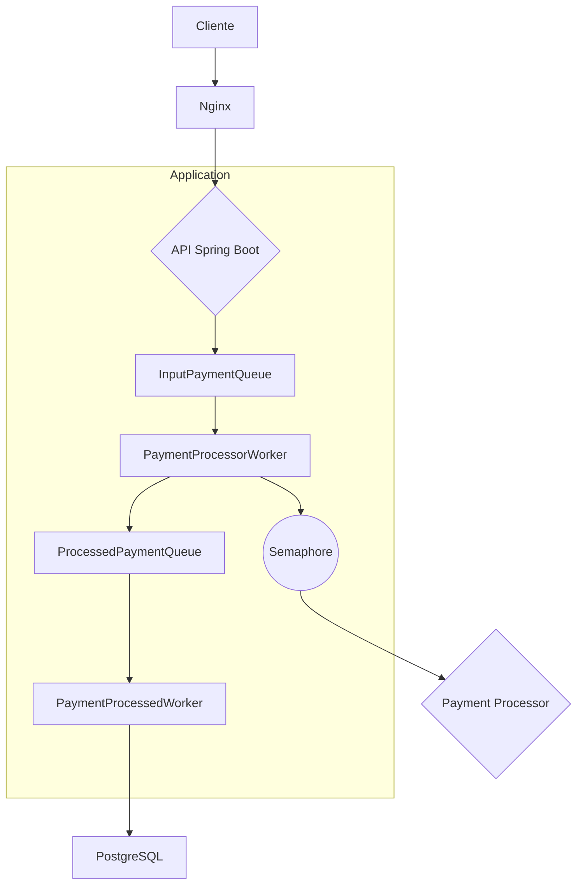

[#  Rinha de Backend 2025

Este projeto é uma implementação para o desafio [Rinha de Backend 2025](https://github.com/zanfranceschi/rinha-de-backend-2025/blob/main/INSTRUCOES.md).

##  Tecnologias Utilizadas

- **Linguagem:** Java 21
- **Framework:** Spring Boot 3
- **Banco de Dados:** PostgreSQL
- **Servidor Web:** Undertow
- **Build:** Maven
- **Virtualização:** Docker
- **Load Balancer:** Nginx
- **Compilação Nativa:** GraalVM

## ️ Arquitetura

A arquitetura da aplicação foi projetada para ser resiliente, escalável e de alta performance, com foco em baixa latência na resposta ao cliente. Para isso, a aplicação utiliza um fluxo de processamento totalmente assíncrono.

- **Nginx:** Atua como um load balancer, distribuindo as requisições entre as instâncias da aplicação backend.
- **Backend (Spring Boot):** A aplicação principal, responsável por receber as requisições de pagamento e orquestrar o processamento assíncrono. O `docker-compose.yml` está configurado para executar duas instâncias da aplicação para alta disponibilidade.
- **PostgreSQL:** O banco de dados utilizado para persistir os dados da aplicação, com otimizações para alta performance.
- **GraalVM:** O projeto está configurado para compilar uma imagem nativa, o que resulta em um tempo de inicialização mais rápido e menor consumo de memória.
- **Undertow:** Servidor web de alta performance, utilizado no lugar do Tomcat padrão do Spring Boot.

### ✨ Padrões e Funcionalidades

- **Arquitetura em Camadas:** O código é organizado em camadas (`api`, `core`, `domain`, `infrastructure`), promovendo a separação de responsabilidades e a manutenibilidade.
- **Processamento Assíncrono:** A aplicação utiliza um pipeline de filas em memória e workers para processar os pagamentos de forma assíncrona, garantindo que a API de entrada seja extremamente rápida.
- **Persistência Otimizada:** A aplicação utiliza estratégias de persistência otimizadas com base no volume de dados, alternando entre inserções individuais, em lote (`batch`) e o comando `COPY` do PostgreSQL para máxima eficiência.
- **Cliente HTTP Declarativo:** A comunicação com os processadores de pagamento é feita através de um cliente HTTP declarativo (`@HttpExchange`), simplificando o código e melhorando a legibilidade.
- **Health Check:** Um sistema de health check monitora a saúde dos processadores de pagamento, permitindo que a aplicação troque para um processador de fallback caso o principal fique indisponível.
- **Build Multi-Stage:** O `Dockerfile` utiliza um build multi-stage para criar uma imagem nativa com GraalVM e, em seguida, copia o executável para uma imagem `distroless`, resultando em uma imagem final extremamente enxuta e segura.

##  Fluxo da Aplicação

O fluxo de processamento de um pagamento é totalmente assíncrono, garantindo uma resposta rápida ao cliente:



1.  O cliente envia uma requisição de pagamento para o Nginx.
2.  O Nginx encaminha a requisição para uma das instâncias do backend.
3.  A API recebe a requisição, a enfileira na `InputPaymentQueue` e retorna imediatamente `202 ACCEPTED`.
4.  O `PaymentProcessorWorker` consome da `InputPaymentQueue`, envia o pagamento para o processador externo e enfileira o resultado na `ProcessedPaymentQueue`.
5.  O `PaymentProcessedWorker` consome da `ProcessedPaymentQueue` e persiste o pagamento processado no PostgreSQL.

## ⚙️ Como Executar

Para executar o projeto, você precisa ter o Docker e o Docker Compose instalados.

**Importante:** Esta aplicação depende dos processadores de pagamento externos. Certifique-se de que eles estejam em execução e acessíveis pela rede `payment-processor`. Para mais detalhes, consulte o [repositório oficial da Rinha de Backend](https://github.com/zanfranceschi/rinha-de-backend-2025).

1. **Construa a imagem da aplicação:**
   ```bash
   ./build.sh
   ```

2. **Inicie os containers:**
   ```bash
   docker-compose up -d
   ```

A aplicação estará disponível na porta `9999`.]()