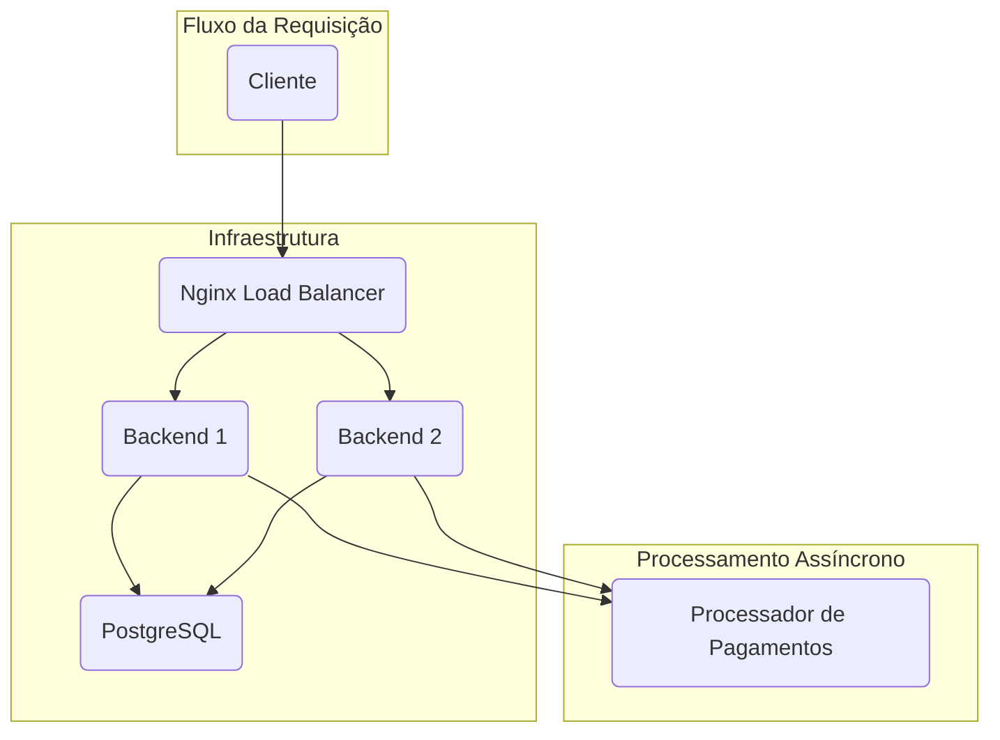

# 🏆 Rinha de Backend 2025

Este projeto é uma implementação para o desafio [Rinha de Backend 2025](https://github.com/zanfranceschi/rinha-de-backend-2025/blob/main/INSTRUCOES.md).

## 🚀 Tecnologias Utilizadas

- **Linguagem:** Java 21
- **Framework:** Spring Boot 3
- **Banco de Dados:** PostgreSQL
- **Build:** Maven
- **Virtualização:** Docker
- **Load Balancer:** Nginx
- **Compilação Nativa:** GraalVM

## 🏗️ Arquitetura

A arquitetura da aplicação foi projetada para ser resiliente e escalável, utilizando os seguintes componentes:


```mermaid
graph TD
    subgraph "Infraestrutura"
        LB(Nginx Load Balancer)
        B1(Backend 1)
        B2(Backend 2)
        DB(PostgreSQL)
    end

    subgraph "Fluxo da Requisição"
        C(Cliente) --> LB
        LB --> B1
        LB --> B2
        B1 --> DB
        B2 --> DB
    end

    subgraph "Processamento Assíncrono"
        B1 --> P(Processador de Pagamentos)
        B2 --> P
    end
```


- **Nginx:** Atua como um load balancer, distribuindo as requisições entre as instâncias da aplicação backend.
- **Backend (Spring Boot):** A aplicação principal, responsável por processar os pagamentos. O `docker-compose.yml` está configurado para executar duas instâncias da aplicação para alta disponibilidade.
- **PostgreSQL:** O banco de dados utilizado para persistir os dados da aplicação.
- **GraalVM:** O projeto está configurado para compilar uma imagem nativa, o que resulta em um tempo de inicialização mais rápido e menor consumo de memória.

### ✨ Padrões e Funcionalidades

- **Padrão Outbox:** A aplicação utiliza o padrão outbox para garantir a consistência entre o banco de dados e os sistemas externos. Os eventos de pagamento são salvos em uma tabela `outbox` e processados de forma assíncrona. O processamento é thread-safe entre as múltiplas instâncias da aplicação através de um lock no banco de dados, garantindo que cada evento seja processado apenas uma vez.
- **Health Check:** Um sistema de health check monitora a saúde dos processadores de pagamento, permitindo que a aplicação troque para um processador de fallback caso o principal fique indisponível.
- **Agendadores (Schedulers):** Tarefas agendadas são utilizadas para processar os eventos da outbox, limpar a tabela de eventos e atualizar o status dos health checks.

## 🌊 Fluxo da Aplicação

1.  O cliente envia uma requisição de pagamento para o Nginx.
2.  O Nginx, atuando como load balancer, encaminha a requisição para uma das instâncias do backend.
3.  A aplicação backend recebe a requisição e salva os dados do pagamento no banco de dados com o status inicial.
4.  Um evento de pagamento é criado na tabela `outbox`.
5.  Um processo assíncrono (scheduler) lê os eventos da tabela `outbox` e os envia para o processador de pagamentos externo.
6.  O status do pagamento é atualizado no banco de dados com base na resposta do processador.

## ⚙️ Como Executar

Para executar o projeto, você precisa ter o Docker e o Docker Compose instalados.

**Importante:** Esta aplicação depende dos processadores de pagamento externos. Certifique-se de que eles estejam em execução e acessíveis pela rede `payment-processor`. Para mais detalhes, consulte o [repositório oficial da Rinha de Backend](https://github.com/zanfranceschi/rinha-de-backend-2025).

1. **Construa a imagem da aplicação:**
   ```bash
   ./build.sh
   ```

2. **Inicie os containers:**
   ```bash
   docker-compose up -d
   ```

A aplicação estará disponível na porta `9999`.
